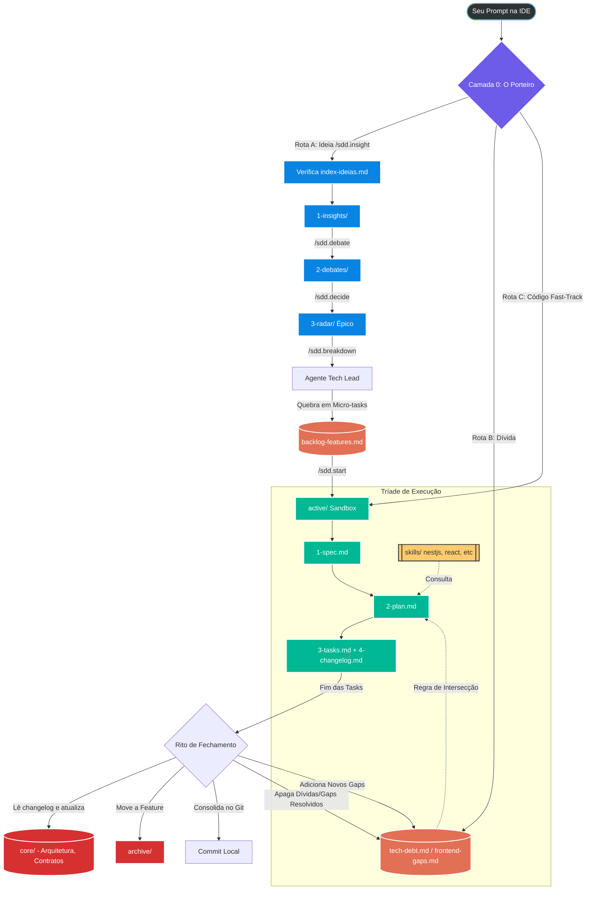

# SDD Automadesk (Spec-Driven Development)

Este framework Híbrido foi desenhado para ecossistemas de alta complexidade (microsserviços, multi-tenant, event-driven), organizando conhecimento em Passado (Archive), Presente (Active) e Futuro (Discovery/Pendencias).

## Fluxograma Visual

## Painel de Controle (Mapas Rápidos)
- [Mapa de Arquitetura](./core/arquitetura.md)
- [Dicionário de Dados](./core/dicionario-dados.md)
- [Sitemap Frontend Existente](./core/frontend-map.md)
- [Catálogo de Ideias](./discovery/index-ideias.md)
- [Fila de Gaps de Frontend](./pendencias/frontend-gaps.md)
- [Dívida Técnica](./pendencias/tech-debt.md)
- [Backlog de Features (Micro-tarefas)](./pendencias/backlog-features.md)

## Como Operar (Comandos)
* `/sdd.insight [ideia]`: Registra uma nova ideia no catálogo.
* `/sdd.debate [ID]`: Move uma ideia para debate.
* `/sdd.decide [ID] [radar/reject]`: Move uma ideia para aprovadas ou rejeitadas.
* `/sdd.breakdown [ID-DO-RADAR]`: Assuma a persona de Tech Lead e quebre tarefas.
* `/sdd.start [ID-DA-FEATURE]`: Inicia execução ativando o Sandbox de isolamento do contexto.
* `/sdd.archive [ID-DA-FEATURE]`: Move do Active para o Archive e consolida.
