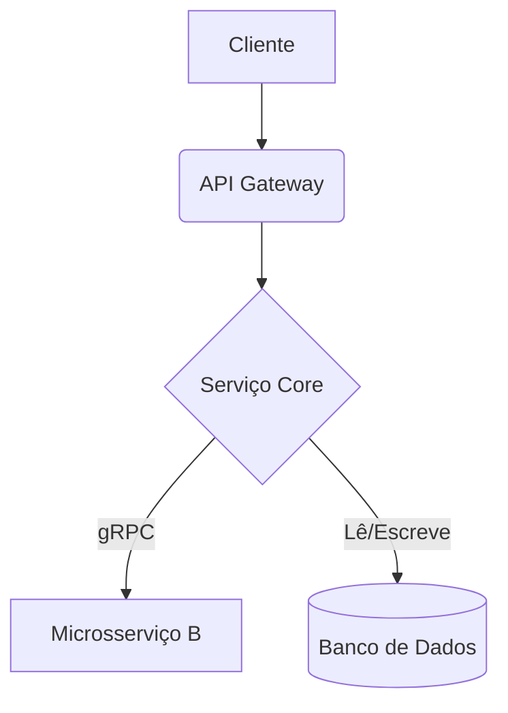

# Mapa de Arquitetura

<!-- Diagrama da Arquitetura Macro da Aplicação -->

```mermaid
graph TD
    %% Substitua por sua arquitetura real
    A[Cliente] --> B(API Gateway)
    B --> C{Serviço Core}
    C -->|gRPC| D[Microsserviço B]
    C -->|Lê/Escreve| E[(Banco de Dados)]
```

## Componentes Principais
- **Componente A**: 
- **Componente B**: 
