# Visao Geral do Fluxo SDD

Este documento resume o fluxo de estados que o projeto implementa, com foco na camada OpenSDD sobre a base OpenSpec.

## Leitura rapida

O sistema opera em dois niveis:

- OpenSpec: base de changes, specs, validacao e archive.
- OpenSDD: memoria operacional, descoberta, backlog executavel, handoff entre agentes e consolidacao documental.

Na pratica, o projeto transforma contexto difuso em execucao rastreavel:

1. instala a base operacional;
2. absorve o contexto do sistema;
3. registra ideias e decisoes;
4. quebra decisoes aprovadas em FEATs executaveis;
5. inicia a execucao com contexto guiado;
6. aplica guardrails, especialmente de frontend;
7. consolida a memoria ao finalizar.

## Fluxo macro do sistema

Imagem renderizada:

Fonte Mermaid editavel: [sdd-fluxo-macro.mmd](/Volumes/WORKSPACE/DEVTRACK_TOOLS/repos-tools/devtrack-tools-opensdd/diagramas/sdd-fluxo-macro.mmd)

## O que cada etapa representa

### 1. Bootstrap

Aqui o projeto recebe a estrutura base do runtime: `openspec/`, `.sdd/`, templates, prompts, skills e arquivos-guia.

### 2. Contexto inicial

Com `sdd init-context`, o repositório existente passa a ser lido como sistema vivo. O objetivo e preencher arquitetura, stack, servicos, contratos e mapa do repositório.

### 3. Onboarding do sistema

O `sdd onboard system` entrega uma visao de entrada para agentes e colaboradores, apontando o estado atual e os proximos passos viaveis.

### 4. Descoberta

O funil de descoberta protege o backlog:

- `INSIGHT`: ideia bruta;
- `DEBATE`: discussao estruturada;
- `RADAR`: ideia aprovada para planejamento;
- `DISCARDED`: ideia rejeitada com motivo.

### 5. Breakdown

Uma decisao aprovada (`RAD`) vira conjunto de `FEATs`. Nessa fase surgem dependencias, bloqueios, paralelizacao e a ordem executavel do trabalho.

### 6. Inicio de execucao

Quando uma `FEAT` entra em andamento, o sistema abre um workspace proprio em `.sdd/active/FEAT-###/`, normalmente com `spec`, `plan`, `tasks` e `changelog`.

### 7. Context pack

Com `sdd context FEAT-###`, o projeto gera um pacote de contexto objetivo para implementacao e handoff entre agentes.

### 8. Guardrails

O fluxo pode ser `direto`, `padrao` ou `rigoroso`. Em fluxos mais rigorosos existem gates formais de aprovacao antes de avancar.

### 9. Impacto de frontend

Antes de consolidar uma FEAT, o sistema exige declaracao de impacto de frontend. Se houver alteracao de UX/UI sem cobertura correspondente, o processo pode abrir `FGAP` ou bloquear a conclusao.

### 10. Archive e finalize

O encerramento real nao e apenas terminar o codigo. Ele exige:

- archive da change;
- finalize da FEAT;
- sincronizacao de docs;
- consolidacao da memoria;
- desbloqueio de dependencias;
- geracao de artefatos como ADR quando aplicavel.

## Fluxo operacional do backlog

Imagem renderizada:

Fonte Mermaid editavel: [sdd-backlog-estados.mmd](/Volumes/WORKSPACE/DEVTRACK_TOOLS/repos-tools/devtrack-tools-opensdd/diagramas/sdd-backlog-estados.mmd)

## Resumo conceitual

O OpenSDD nao substitui o OpenSpec. Ele organiza a operacao por cima dele.

- OpenSpec cuida da base formal de changes e specs.
- OpenSDD cuida do fluxo vivo do projeto: descoberta, backlog, execucao, handoff, memoria e consolidacao.

Por isso, a melhor forma de ler o sistema e:

- `INS -> DEB -> RAD` como funil de descoberta;
- `RAD -> FEAT` como transformacao de decisao em trabalho;
- `FEAT -> start -> context -> implementacao` como ciclo de execucao;
- `frontend-impact -> FGAP` como guardrail de consistencia;
- `archive -> finalize` como fechamento real do conhecimento do projeto.
