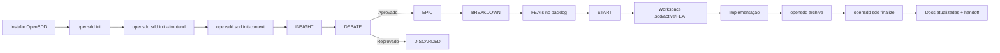
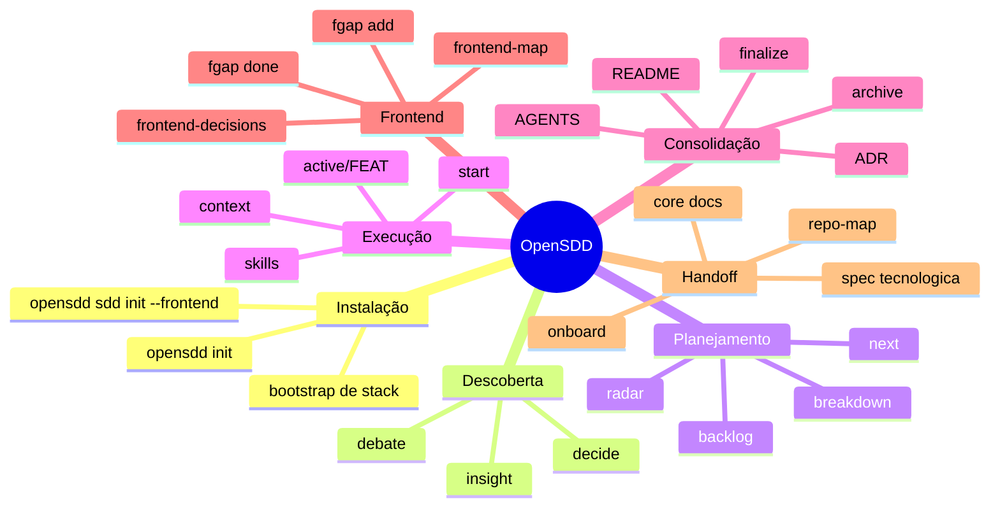

# Manual de Uso do OpenSDD (PT-BR)

Este manual foi escrito para um leigo que quer usar o sistema para desenvolver software com apoio de agentes.

Objetivo do SDD:
- registrar ideias sem perder nada;
- transformar ideias em decisões;
- quebrar decisões em trabalho executável;
- manter documentação viva;
- permitir que um agente novo continue o projeto sem reler o código inteiro.

## 1. O que é cada coisa

- `INSIGHT (INS-0001)`: uma ideia bruta.
- `DEBATE (DEB-0001)`: a discussão estruturada sobre uma ideia.
- `EPIC (EPIC-0001)`: uma ideia aprovada para possível implementação.
- `RAD (RAD-001)`: alias legado compatível para um EPIC.
- `FEATURE (FEAT-0001)`: um pedaço executável de trabalho.
- `FGAP (FGAP-###)`: um gap de frontend.
- `TASKS`: checklist interno da execução de uma FEAT, dentro de `.sdd/active/FEAT-0001/3-tasks.md`.

Regra prática:
- ideia nasce como `INS`;
- decisão aprovada vira `EPIC`;
- trabalho executável vira `FEAT`;
- checklist operacional nasce quando você faz `start`.

## 2. Como o sistema funciona



## 3. Mapa mental do sistema



## 4. Mapa de pastas e o que cada uma faz

```text
AGENTS.md                                 # Guia canônico para agentes/IDEs
AGENT.md                                  # Espelho compatível com ferramentas que usam nome singular
README.md                                 # Entrada principal para humano e agente

.sdd/                                     # Memória operacional do projeto
├── README.md                             # Painel interno do SDD
├── AGENT.md                              # Guia operacional interno do SDD
├── deposito/                             # Fontes brutas e documentos importados
│   ├── prds/                             # PRDs e documentos de produto
│   ├── rfcs/                             # RFCs e documentos técnicos
│   ├── historias/                        # Histórias do usuário
│   ├── wireframes/                       # Wireframes, imagens e esboços
│   ├── html-mocks/                       # HTMLs, protótipos e experimentos visuais
│   ├── referencias-visuais/              # Inspirações de frontend
│   ├── entrevistas/                      # Descoberta com usuário/negócio
│   ├── anexos/                           # Material complementar
│   └── legado/                           # Documentos herdados
├── active/                               # Execução viva por FEAT
│   └── FEAT-0001/
│      ├── 1-spec.md                      # O que a FEAT precisa entregar (layout legacy)
│      ├── 2-plan.md                      # Plano técnico (layout legacy)
│      ├── 3-tasks.md                     # Checklist da execução (layout legacy)
│      ├── 4-changelog.md                 # Mudanças estruturais feitas (layout legacy)
│      ├── 1-especificacao.md             # O que a FEAT precisa entregar (layout pt-BR)
│      ├── 2-planejamento.md              # Plano técnico (layout pt-BR)
│      ├── 3-tarefas.md                   # Checklist da execução (layout pt-BR)
│      └── 4-historico.md                 # Histórico da execução (layout pt-BR)
├── core/                                 # Visão macro atual do sistema
│   ├── index.md                          # Índice do contexto
│   ├── arquitetura.md                    # Arquitetura atual
│   ├── servicos.md                       # Catálogo de serviços
│   ├── spec-tecnologica.md               # Stack tecnológica
│   ├── repo-map.md                       # Mapa dos diretórios relevantes
│   ├── fontes.md                         # Inventário das fontes brutas indexadas
│   ├── frontend-map.md                   # O que existe no frontend
│   ├── frontend-sitemap.md               # Visão consolidada de rotas + gaps
│   ├── frontend-decisions.md             # Por que o frontend foi feito assim
│   └── adrs/                             # ADRs por FEAT consolidada
├── discovery/                            # Funil de descoberta
│   ├── 1-insights/                       # Ideias cruas
│   ├── 2-debates/                        # Debates estruturados
│   ├── 3-radar/                          # Ideias aprovadas
│   └── 4-discarded/                      # Ideias rejeitadas com motivo
├── pendencias/                           # Visões operacionais do backlog
│   ├── backlog-features.md               # Lista de FEATs
│   ├── backlog-graph.md                  # Dependências e paralelismo
│   ├── progress.md                       # Progresso global e por RAD
│   ├── unblocked.md                      # FEATs recém-desbloqueadas
│   ├── tech-debt.md                      # Dívida técnica
│   ├── frontend-gaps.md                  # Gaps de frontend pendentes
│   ├── frontend-gaps-resolvidos.md       # Gaps de frontend resolvidos
│   └── frontend-auditoria.md             # Auditoria por FEAT (impacto/cobertura)
└── state/                                # Fonte de verdade canônica
   ├── discovery-index.yaml               # INS/DEB/RAD
   ├── backlog.yaml                       # FEATs
   ├── architecture.yaml                  # Arquitetura
   ├── service-catalog.yaml               # Serviços
   ├── tech-stack.yaml                    # Stack
   ├── integration-contracts.yaml         # Contratos/integrações
   ├── repo-map.yaml                      # Mapa do repositório
   ├── source-index.yaml                  # Índice canônico das fontes brutas
   ├── frontend-map.yaml                  # Frontend existente
   ├── frontend-gaps.yaml                 # Gaps de frontend
   └── frontend-decisions.yaml            # Decisões de frontend

openspec/
└── changes/                              # Mudanças executáveis do OpenSpec
   ├── <change-name>/                     # Change em andamento
   └── archive/                           # Changes arquivadas
```

## 5. Instalação e primeiro uso

### 5.1 Pré-requisitos

- Node.js `20.19.0` ou superior
- `npm` ou `pnpm`

### 5.2 Como instalar o comando `opensdd`

Voce tem 2 formas de instalar.

#### Opcao A: instalar o pacote oficial publicado no npm (recomendado)

```bash
npm install -g @gfmozzer/opensdd
```

Depois confira:

```bash
opensdd --version
```

#### Opcao B: instalar a sua copia local deste fork (desenvolvimento)

Use isso se voce esta desenvolvendo o fork localmente:

```bash
cd /caminho/do/seu-fork
pnpm install
pnpm run build
npm install -g .
```

Alternativa para desenvolvimento local com link:

```bash
cd /caminho/do/seu-fork
pnpm install
pnpm run build
npm link
```

Regra pratica:
- `npm install -g @gfmozzer/opensdd` instala globalmente o pacote oficial;
- `npm install -g .` instala a sua copia local deste fork;
- `npm link` serve para desenvolvimento local com seu fork.

### 5.3 Como instalar o OpenSDD dentro do repositório do seu projeto

Depois de instalar o comando `opensdd`, va para o repositório onde voce quer usar o sistema:

```bash
cd seu-projeto
```

Agora instale o OpenSDD completo dentro desse repositório.

Se voce nao quer configurar nenhuma IDE/agente agora:

```bash
opensdd install --tools none
```

Para usar nomenclatura de pastas em portugues desde o inicio:

```bash
opensdd install --tools none --lang pt-BR --layout pt-BR
```

Se voce ja quer configurar ferramentas na instalacao:

```bash
opensdd install --tools codex,cursor
```

Ou:

```bash
opensdd install --tools all
```

Isso cria, em um passo:
- a base de runtime do OpenSDD;
- a pasta `.sdd/`;
- as skills curadas;
- os templates;
- os YAMLs canônicos;
- os guias `README.md`, `AGENTS.md`, `AGENT.md` e `.sdd/AGENT.md`.

Se quiser desativar o modulo de frontend no bootstrap:

```bash
opensdd install --tools none --no-frontend
```

Atalho equivalente em portugues:

```bash
opensdd instalar --tools none --lang pt-BR --layout pt-BR
```

### 5.4 Instalar o SDD dentro do repositório

Se voce usou `opensdd install`, esta etapa ja foi executada automaticamente.

Ela corresponde internamente a:

```bash
opensdd sdd init --frontend
```

Isso cria:
- a pasta `.sdd/`;
- o dashboard interno `.sdd/README.md`;
- os YAMLs canônicos;
- os guias `README.md`, `AGENTS.md`, `AGENT.md` e `.sdd/AGENT.md`;
- as views em `.sdd/core/` e `.sdd/pendencias/`.
- o catalogo curado de 64 skills em `.sdd/state/skill-catalog.yaml`;
- as skills locais em `.sdd/skills/curated/` (layout legacy) ou `.sdd/habilidades/skills/` (layout pt-BR).
- os templates em `.sdd/templates/`.
- a pasta `.sdd/deposito/` para documentos brutos.
- o índice `.sdd/state/source-index.yaml` para rastrear essas fontes.

Esse e o comando que efetivamente instala o "servico" SDD dentro do seu projeto.

### 5.5 Instalação completa em um projeto novo

Se o projeto esta vazio ou acabou de nascer, o fluxo completo e:

```bash
npm install -g @gfmozzer/opensdd
cd seu-projeto
opensdd install --tools none
opensdd sdd init --frontend
opensdd sdd check --render
opensdd sdd onboard system
```

Se estiver usando o seu fork local, troque apenas a forma de instalar o comando `opensdd`. O restante e igual.

### 5.6 O que acontece automaticamente no primeiro `sdd init`

Se o projeto já tiver uma base instalada, o SDD tenta gerar contexto inicial automaticamente.

Exemplos:
- se existir `package.json`, ele lê nome do projeto;
- se existir `tsconfig.json`, ele registra TypeScript;
- se detectar `@nestjs/core`, registra NestJS na stack;
- se detectar React, Next, Prisma, Redis, Vitest, Jest e outras tecnologias comuns, registra isso na stack;
- se detectar diretórios como `src/`, `test/`, `docs/`, `openspec/`, ele monta o `repo-map`;
- ele cria um nó inicial de arquitetura;
- ele cria um serviço inicial no catálogo.
- ele semeia a curadoria padrao de skills (7 bundles / 64 skills);
- ele tenta sincronizar automaticamente essas skills para ferramentas detectadas (ex.: `.codex`, `.cursor`, `.claude`).

Ou seja: você não começa no vazio.

### 5.7 Quando o projeto já existe (legado)

Se você vai trabalhar em base grande já existente (ex.: Chatwoot customizado), rode:

```bash
opensdd sdd init-context
```

Esse comando faz inspeção mais profunda e tenta preencher:
- `architecture.yaml`
- `service-catalog.yaml`
- `tech-stack.yaml`
- `integration-contracts.yaml`
- `repo-map.yaml`

Fluxo recomendado para projeto legado:

```bash
npm install -g @gfmozzer/opensdd
cd projeto-legado
opensdd install --tools none
opensdd sdd init --frontend
opensdd sdd init-context
opensdd sdd check --render
opensdd sdd onboard system
```

### 5.8 Validar e renderizar

```bash
opensdd sdd check --render
```

Use isso logo após o `init`.

## 6. Como criar o primeiro contexto tecnológico

Suponha que você criou um projeto NestJS e só instalou a base inicial. Faça:

```bash
opensdd install --tools none
opensdd sdd init --frontend
opensdd sdd init-context
opensdd sdd check --render
opensdd sdd onboard system
```

Depois leia:
- `README.md`
- `AGENTS.md`
- `.sdd/AGENT.md`
- `.sdd/core/index.md`
- `.sdd/core/arquitetura.md`
- `.sdd/core/servicos.md`
- `.sdd/core/spec-tecnologica.md`
- `.sdd/core/repo-map.md`

Isso já vira o primeiro contexto do projeto.

## 7. Como usar o sistema no dia a dia

### 7.0 Como começar com documentos consolidados

Se voce ja tem PRD, briefing, RFC, wireframe, html de esboco, imagens ou referencias visuais, nao comece por `insight`.

Coloque o material em `.sdd/deposito/`, por exemplo:

```text
.sdd/deposito/prds/PRD-inicial.md
.sdd/deposito/historias/jornadas.md
.sdd/deposito/wireframes/home.png
.sdd/deposito/html-mocks/dashboard.html
```

Regra:
- o deposito guarda fonte bruta;
- a fonte canonica continua em `.sdd/state/*.yaml`;
- o inventario oficial dessas fontes fica em `.sdd/state/source-index.yaml`;
- a view humana dessas fontes fica em `.sdd/core/fontes.md`.

Fluxo recomendado:
1. colocar os documentos no deposito;
2. rodar `opensdd sdd ingest-deposito`;
3. validar o resultado com `opensdd sdd check --render`;
4. continuar por `opensdd sdd next` e `opensdd sdd context FEAT-0001`.

Comando principal:

```bash
opensdd sdd ingest-deposito --title "Planejamento inicial do sistema"
```

Se for seu primeiro contato com o sistema, abra primeiro:
- `.sdd/prompts/00-comece-por-aqui.md`

O que ele faz:
- varre `.sdd/deposito/`;
- atualiza `.sdd/state/source-index.yaml`;
- cria (ou reaproveita) RAD;
- desdobra em FEATs com `breakdown` incremental;
- tenta iniciar automaticamente a primeira FEAT pronta e gerar workspace em `.sdd/active/FEAT-0001/`;
- aponta skills e prompt recomendado em `.sdd/prompts/01-ingestao-deposito.md`.

Flags úteis:
- `--no-start`: só gera trilha executável, sem iniciar FEAT.
- `--radar RAD-###`: reaproveita uma iniciativa existente.
- `--titles "A,B,C"`: força títulos de FEAT.
- `--source-dir <path>`: usa outro diretório de insumos.

Resumo objetivo:
- documento bruto nao vira task direto;
- ele vira contexto, `RAD` ou `FEAT`;
- debate so entra quando a fonte estiver ambigua, conflituosa ou incompleta.

### 7.1 Como registrar uma ideia

```bash
opensdd sdd insight "Clientes precisam marcar banho online"
```

O que isso faz:
- cria um `INS-0001`;
- grava no índice canônico;
- cria o arquivo em `.sdd/discovery/1-insights/`.

### 7.2 Como iniciar um debate

```bash
opensdd sdd debate INS-0001
```

O que isso faz:
- cria `DEB-0001`;
- vincula o debate ao insight;
- gera um documento de debate com template formal.

### 7.3 Como aprovar um debate

Depois de preencher o arquivo do debate:

```bash
opensdd sdd decide DEB-0001 --outcome epic --rationale "Dor principal do negócio"
```

O que isso faz:
- valida se o debate está completo;
- aprova a ideia;
- cria um `RAD-###`.

### 7.4 Como reprovar um debate

```bash
opensdd sdd decide DEB-0001 --outcome discard --rationale "Não é prioridade agora"
```

O que isso faz:
- encerra o debate;
- registra o descarte com motivo;
- evita rediscutir a mesma ideia sem contexto.

### 7.5 Como iniciar um planejamento

Planejamento começa no `EPIC`.

```bash
opensdd sdd breakdown EPIC-0001 --mode graph --incremental --titles "API de agendamento,Calendário por loja,Tela do cliente"
```

O que isso faz:
- transforma o radar em FEATs executáveis;
- cria dependências (`blocked_by`);
- cria grupos de paralelismo;
- tenta integrar o novo grafo com o backlog já existente.

### 7.6 Como criar uma tarefa

No SDD, há dois níveis:

1. Criar uma `FEAT`:
- pelo `desdobrar` (alias de `breakdown`) de um `RAD`; ou
- direto com `start` usando texto livre.

Exemplo criando FEAT direta com fluxo:

```bash
opensdd sdd start "Criar endpoint de healthcheck" --fluxo padrao
```

2. Criar a lista de tarefas internas da execução:
- isso acontece automaticamente quando você roda `start`.

O comando gera:
- `.sdd/active/FEAT-0001/1-spec.md`
- `.sdd/active/FEAT-0001/2-plan.md`
- `.sdd/active/FEAT-0001/3-tasks.md`
- `.sdd/active/FEAT-0001/4-changelog.md`

No layout `pt-BR`, os nomes gerados sao:
- `.sdd/execucao/FEAT-0001/1-especificacao.md`
- `.sdd/execucao/FEAT-0001/2-planejamento.md`
- `.sdd/execucao/FEAT-0001/3-tarefas.md`
- `.sdd/execucao/FEAT-0001/4-historico.md`

### 7.7 Como iniciar a execução de uma FEAT

```bash
opensdd sdd start FEAT-0001
```

O que isso faz:
- marca a FEAT como `IN_PROGRESS`;
- valida bloqueios e conflitos;
- cria um `change` dentro de `openspec/changes`;
- cria o workspace ativo da FEAT;
- sugere skills e bundles.

### 7.8 Como saber o que pode começar agora

```bash
opensdd sdd next
```

O que isso faz:
- mostra o que está pronto;
- mostra o que está bloqueado;
- mostra conflitos de lock;
- ranqueia o que tende a ter mais impacto.

### 7.9 Como gerar contexto para um agente

```bash
opensdd sdd context FEAT-0001 --json
```

O que isso faz:
- entrega resumo;
- origem;
- dependências;
- serviços relevantes;
- contratos relevantes;
- ADRs;
- decisões de frontend;
- ordem de leitura;
- caminho do workspace ativo.

### 7.10 Como fazer onboarding de um agente novo

```bash
opensdd sdd onboard system
```

Ou:

```bash
opensdd sdd onboard EPIC-0001
opensdd sdd onboard FEAT-0001
```

Use:
- `system` para visão geral;
- `RAD` para uma iniciativa;
- `FEAT` para uma execução específica.

### 7.11 Como arquivar uma tarefa

Aqui existe uma distinção importante:

1. arquivar a mudança técnica do OpenSpec;
2. consolidar a memória SDD.

Passo 1:

```bash
opensdd archive <change-name>
```

Passo 2:

```bash
opensdd sdd finalize --ref FEAT-0001
```

Resumo:
- `archive` move a change para `openspec/changes/archive/`;
- `finalize` marca a FEAT como concluída e consolida a memória documental.

### 7.12 Como declarar impacto de frontend (obrigatório)

```bash
opensdd sdd frontend-impact FEAT-0001 --status required --reason "Nova rota e interface de cadastro"
```

Sem isso, o `finalize` bloqueia por padrão.

Para caso sem impacto:

```bash
opensdd sdd frontend-impact FEAT-0001 --status none --reason "Mudança interna de backend sem alteração de UI"
```

A justificativa para `none` precisa ter no mínimo 20 caracteres.

### 7.13 Como finalizar uma execução

```bash
opensdd sdd finalize --ref FEAT-0001
```

O que isso faz:
- marca a FEAT como `DONE`;
- gera ADR;
- desbloqueia dependentes;
- atualiza arquitetura, serviços, stack e repo-map;
- sincroniza `README.md`, `.sdd/AGENT.md`, `AGENTS.md` e `AGENT.md`.
- aplica guardrails de frontend (bloqueia quando faltar declaração/cobertura).

### 7.14 Como registrar gap de frontend

Abrir um gap:

```bash
opensdd sdd fgap add "Tela de prontuário ainda não existe" --origin FEAT-0005 --routes /prontuario
```

Marcar como resolvido:

```bash
opensdd sdd fgap done FGAP-001 --feature FEAT-0008 --files src/pages/prontuario.tsx --routes /prontuario
```

Automacao nova:
- no `finalize`, se `frontend_impact_status=required` e ainda nao houver `frontend_gap_refs`, o SDD cria `FGAP` automatico e bloqueia a finalizacao na mesma execucao (a menos que use `--force-frontend`).
- o arquivo `frontend-gaps.md` mostra apenas pendentes.
- os resolvidos ficam em `frontend-gaps-resolvidos.md`.
- o panorama consolidado de rotas + pendencias + resolvidos fica em `.sdd/core/frontend-sitemap.md`.
- a auditoria consolidada por FEAT fica em `.sdd/pendencias/frontend-auditoria.md`.

### 7.15 Como usar skills

Listar bundles:

```bash
opensdd sdd skills bundles
```

Pedir sugestão:

```bash
opensdd sdd skills suggest --phase plan --domains backend,api
```

Sincronizar:

```bash
opensdd sdd skills sync --all
```

Observacao:
- no `opensdd sdd init`, a sincronizacao ja roda automaticamente para ferramentas detectadas;
- use `skills sync` quando instalar uma nova IDE/agente depois.
- para fontes consolidadas, as skills principais sao:
  - `source-intake-sdd`
  - `business-extractor-sdd`
  - `frontend-extractor-sdd`
  - `planning-normalizer-sdd`

## 8. Tabela de comandos e o que cada um faz

| Comando | Para que serve |
| --- | --- |
| `opensdd install` | Instala/inicializa a base do OpenSDD no projeto |
| `opensdd instalar` | Alias em portugues para `opensdd install` |
| `opensdd init` | Alias tecnico para instalar/inicializar a base do OpenSDD |
| `opensdd sdd init --frontend` | Inicializa a memória SDD e carrega skills curadas |
| `opensdd sdd iniciar` | Alias em portugues para `opensdd sdd init` |
| `opensdd sdd init-context` | Inspeciona projeto existente e completa contexto inicial |
| `opensdd sdd iniciar-contexto` | Alias em portugues para `opensdd sdd init-context` |
| `opensdd sdd check --render` | Valida e renderiza |
| `opensdd sdd check --render --strict` | Valida, renderiza e transforma avisos de integridade referencial em erros |
| `opensdd sdd checar --render` | Alias em portugues para `opensdd sdd check --render` |
| `opensdd sdd ingest-deposito` | Varrer depósito e gerar trilha executável inicial |
| `opensdd sdd ingestao-deposito` | Alias em portugues para `opensdd sdd ingest-deposito` |
| `opensdd sdd ingest` | Alias curto para `opensdd sdd ingest-deposito` |
| `opensdd sdd insight "<texto>"` | Cria um insight |
| `opensdd sdd ideia "<texto>"` | Alias em portugues para `opensdd sdd insight` |
| `opensdd sdd debate INS-0001` | Abre debate |
| `opensdd sdd debater INS-0001` | Alias em portugues para `opensdd sdd debate` |
| `opensdd sdd decide DEB-0001 --outcome epic` | Aprova debate |
| `opensdd sdd decide DEB-0001 --outcome discard` | Reprova debate |
| `opensdd sdd decidir DEB-0001 --outcome ...` | Alias em portugues para `opensdd sdd decide` |
| `opensdd sdd breakdown EPIC-0001 --mode graph` | Planeja um EPIC em FEATs |
| `opensdd sdd quebrar RAD-### --mode graph` | Alias em portugues para `opensdd sdd breakdown` |
| `opensdd sdd desdobrar EPIC-0001 --mode graph` | Alias em portugues para `opensdd sdd breakdown` |
| `opensdd sdd start FEAT-0001` | Inicia execução |
| `opensdd sdd start "texto livre"` | Cria FEAT direta e já inicia |
| `opensdd sdd start ... --fluxo direto|padrao|rigoroso` | Define o nivel de rigor sem burocracia excessiva |
| `opensdd sdd iniciar-execucao FEAT-0001` | Alias em portugues para `opensdd sdd start` |
| `opensdd sdd aprovar FEAT-0001 --etapa proposta|planejamento|tarefas` | Aprova gate de etapa para a FEAT |
| `opensdd sdd next` | Diz o que começar agora |
| `opensdd sdd proximo` | Alias em portugues para `opensdd sdd next` |
| `opensdd sdd context FEAT-0001` | Gera contexto da FEAT |
| `opensdd sdd contexto FEAT-0001` | Alias em portugues para `opensdd sdd context` |
| `opensdd sdd frontend-impact FEAT-0001 --status required\|none --reason "..."` | Declara impacto frontend obrigatório antes do finalize |
| `opensdd sdd impacto-frontend FEAT-0001 ...` | Alias em portugues para `opensdd sdd frontend-impact` |
| `opensdd sdd onboard system` | Gera onboarding global |
| `opensdd sdd integrar system` | Alias em portugues para `opensdd sdd onboard` |
| `opensdd sdd orientar system` | Alias em portugues para `opensdd sdd onboard` |
| `opensdd archive <change-name>` | Arquiva a mudança técnica |
| `opensdd arquivar <change-name>` | Alias em portugues para `opensdd archive` |
| `opensdd sdd finalize --ref FEAT-0001` | Consolida memória e conclui FEAT |
| `opensdd sdd consolidar --ref FEAT-0001` | Alias em portugues para `opensdd sdd finalize` |
| `opensdd sdd fgap add ...` | Registra gap de frontend |
| `opensdd sdd fgap done ...` | Marca gap resolvido |
| `opensdd sdd skills bundles` | Lista bundles |
| `opensdd sdd skills usar --ids ...` | Gera prompt pronto para invocar skills no agente |
| `opensdd sdd skills invocar --ids ...` | Alias em portugues para `opensdd sdd skills usar` |
| `opensdd sdd skills suggest ...` | Sugere skills |
| `opensdd sdd skills sync --all` | Sincroniza skills curadas |

Observacao: quando o backlog ainda nao tiver FEAT pronta, `onboard system` retorna `proximos_passos` guiados com comandos acionaveis para o usuario nao ficar travado.

## 8.1 Fluxo rapido para PRD e documentos consolidados

1. Copie o material para `.sdd/deposito/`.
2. Rode `opensdd sdd ingest-deposito`.
3. Use `opensdd sdd check --render` para revisar.
4. Continue por `opensdd sdd next` e `opensdd sdd start FEAT-0001`.
5. So use `insight/debate` para excecoes e ambiguidades.

## 9. Exemplo completo: como a Marina usaria

Versao estendida desta historia:
- `docs/historia-marina-uso-pratico.md`

### 9.1 Marina instala e cria a base

```bash
npm install -g @gfmozzer/opensdd
opensdd install --tools none
opensdd sdd init --frontend
opensdd sdd init-context
opensdd sdd check --render
opensdd sdd onboard system
```

### 9.2 Marina despeja ideias

```bash
opensdd sdd insight "Clientes precisam agendar banho online"
opensdd sdd insight "Veterinario precisa registrar prontuario digital"
opensdd sdd insight "Quero programa de fidelidade"
```

### 9.3 Marina debate e aprova

```bash
opensdd sdd debate INS-0001
opensdd sdd decide DEB-0001 --outcome epic --rationale "Dor principal"
```

### 9.4 Marina quebra em trabalho executável

```bash
opensdd sdd breakdown EPIC-0001 --mode graph --incremental --titles "API de agendamento,Calendario por loja,Tela de agendamento"
```

### 9.5 Marina inicia execução

```bash
opensdd sdd next
opensdd sdd start FEAT-0001
opensdd sdd context FEAT-0001
opensdd sdd frontend-impact FEAT-0001 --status required --reason "Nova rota e nova tela de agendamento"
```

### 9.6 Marina aparece com insight no meio do caminho

```bash
opensdd sdd insight "Cada loja tem catalogo diferente de servicos"
opensdd sdd debate INS-0009
opensdd sdd decide DEB-0009 --outcome epic --rationale "Impacta agendamento"
opensdd sdd breakdown EPIC-0006 --mode graph --incremental --titles "Catalogo de servicos por loja"
```

### 9.7 Marina arquiva e consolida

```bash
opensdd archive <change-name>
opensdd sdd finalize --ref FEAT-0001
opensdd sdd check --render
opensdd sdd onboard system
```

## 10. Como conversar com o agente em português

Use algo assim no começo da sessão:

```text
Responda em português do Brasil.
Use o fluxo do OpenSDD.
Antes de executar, me diga se estou em insight, debate, radar, breakdown, feat ou finalize.
Se a tarefa impactar a arquitetura, stack, frontend ou onboarding, atualize a documentação.
```

## 11. Como saber se você está usando corretamente

Você está usando certo quando:
- novas ideias viram `INS`;
- decisões aprovadas viram `RAD`;
- trabalho executável vira `FEAT`;
- toda FEAT em execução tem `.sdd/active/FEAT-0001/`;
- toda consolidação roda `archive` e depois `finalize`;
- a documentação central cresce junto com o projeto.

## 12. Regra mais importante do sistema

Se a implementação mudou algo importante e isso não entrou em:
- `README.md`
- `AGENTS.md`
- `AGENT.md`
- `.sdd/AGENT.md`
- `.sdd/core/*.md`
- `.sdd/state/*.yaml`

então a memória do projeto está degradando.

No SDD, implementar sem consolidar contexto significa voltar a pilotar no escuro.
