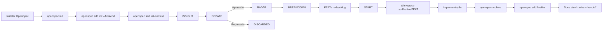
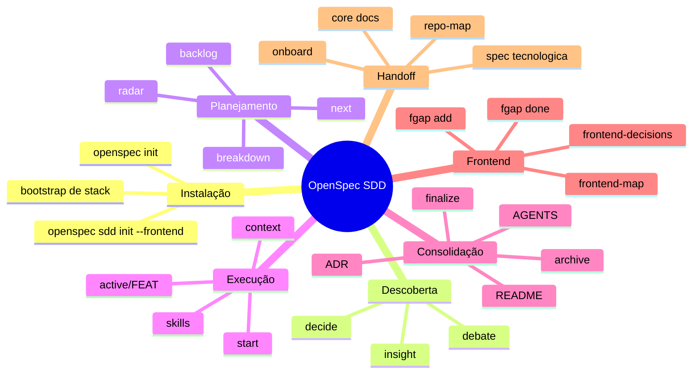

# Manual de Uso do OpenSpec SDD (PT-BR)

Este manual foi escrito para um leigo que quer usar o sistema para desenvolver software com apoio de agentes.

Objetivo do SDD:
- registrar ideias sem perder nada;
- transformar ideias em decisões;
- quebrar decisões em trabalho executável;
- manter documentação viva;
- permitir que um agente novo continue o projeto sem reler o código inteiro.

## 1. O que é cada coisa

- `INSIGHT (INS-###)`: uma ideia bruta.
- `DEBATE (DEB-###)`: a discussão estruturada sobre uma ideia.
- `RADAR (RAD-###)`: uma ideia aprovada para possível implementação.
- `FEATURE (FEAT-###)`: um pedaço executável de trabalho.
- `FGAP (FGAP-###)`: um gap de frontend.
- `TASKS`: checklist interno da execução de uma FEAT, dentro de `.sdd/active/FEAT-###/3-tasks.md`.

Regra prática:
- ideia nasce como `INS`;
- decisão aprovada vira `RAD`;
- trabalho executável vira `FEAT`;
- checklist operacional nasce quando você faz `start`.

## 2. Como o sistema funciona



## 3. Mapa mental do sistema



## 4. Mapa de pastas e o que cada uma faz

```text
AGENTS.md                                 # Guia canônico para agentes/IDEs
AGENT.md                                  # Espelho compatível com ferramentas que usam nome singular
README.md                                 # Entrada principal para humano e agente

.sdd/                                     # Memória operacional do projeto
├── agente.md                             # Guia operacional interno do SDD
├── active/                               # Execução viva por FEAT
│   └── FEAT-###/
│      ├── 1-spec.md                      # O que a FEAT precisa entregar
│      ├── 2-plan.md                      # Plano técnico
│      ├── 3-tasks.md                     # Checklist da execução
│      └── 4-changelog.md                 # Mudanças estruturais feitas
├── core/                                 # Visão macro atual do sistema
│   ├── index.md                          # Índice do contexto
│   ├── arquitetura.md                    # Arquitetura atual
│   ├── servicos.md                       # Catálogo de serviços
│   ├── spec-tecnologica.md               # Stack tecnológica
│   ├── repo-map.md                       # Mapa dos diretórios relevantes
│   ├── frontend-map.md                   # O que existe no frontend
│   ├── frontend-decisions.md             # Por que o frontend foi feito assim
│   └── adrs/                             # ADRs por FEAT consolidada
├── discovery/                            # Funil de descoberta
│   ├── 1-insights/                       # Ideias cruas
│   ├── 2-debates/                        # Debates estruturados
│   ├── 3-radar/                          # Ideias aprovadas
│   └── 4-discarded/                      # Ideias rejeitadas com motivo
├── pendencias/                           # Visões operacionais do backlog
│   ├── backlog-features.md               # Lista de FEATs
│   ├── backlog-graph.md                  # Dependências e paralelismo
│   ├── progress.md                       # Progresso global e por RAD
│   ├── unblocked.md                      # FEATs recém-desbloqueadas
│   ├── tech-debt.md                      # Dívida técnica
│   └── frontend-gaps.md                  # Gaps de frontend
└── state/                                # Fonte de verdade canônica
   ├── discovery-index.yaml               # INS/DEB/RAD
   ├── backlog.yaml                       # FEATs
   ├── architecture.yaml                  # Arquitetura
   ├── service-catalog.yaml               # Serviços
   ├── tech-stack.yaml                    # Stack
   ├── integration-contracts.yaml         # Contratos/integrações
   ├── repo-map.yaml                      # Mapa do repositório
   ├── frontend-map.yaml                  # Frontend existente
   ├── frontend-gaps.yaml                 # Gaps de frontend
   └── frontend-decisions.yaml            # Decisões de frontend

openspec/
└── changes/                              # Mudanças executáveis do OpenSpec
   ├── <change-name>/                     # Change em andamento
   └── archive/                           # Changes arquivadas
```

## 5. Instalação e primeiro uso

### 5.1 Instalar o OpenSpec

```bash
npm install -g @fission-ai/openspec@latest
```

### 5.2 Entrar no projeto

```bash
cd seu-projeto
```

### 5.3 Inicializar o OpenSpec

```bash
openspec init
```

Isso cria a base do OpenSpec no repositório.

### 5.4 Inicializar o SDD

```bash
openspec sdd init --frontend
```

Isso cria:
- a pasta `.sdd/`;
- os YAMLs canônicos;
- os guias `README.md`, `AGENTS.md`, `AGENT.md` e `.sdd/agente.md`;
- as views em `.sdd/core/` e `.sdd/pendencias/`.
- o catalogo curado de 60 skills em `.sdd/state/skill-catalog.yaml`;
- as skills curadas locais em `.sdd/skills/curated/`.

### 5.5 O que acontece automaticamente no primeiro `sdd init`

Se o projeto já tiver uma base instalada, o SDD tenta gerar contexto inicial automaticamente.

Exemplos:
- se existir `package.json`, ele lê nome do projeto;
- se existir `tsconfig.json`, ele registra TypeScript;
- se detectar `@nestjs/core`, registra NestJS na stack;
- se detectar React, Next, Prisma, Redis, Vitest, Jest e outras tecnologias comuns, registra isso na stack;
- se detectar diretórios como `src/`, `test/`, `docs/`, `openspec/`, ele monta o `repo-map`;
- ele cria um nó inicial de arquitetura;
- ele cria um serviço inicial no catálogo.
- ele semeia a curadoria padrao de skills (6 bundles / 60 skills);
- ele tenta sincronizar automaticamente essas skills para ferramentas detectadas (ex.: `.codex`, `.cursor`, `.claude`).

Ou seja: você não começa no vazio.

### 5.6 Quando o projeto já existe (legado)

Se você vai trabalhar em base grande já existente (ex.: Chatwoot customizado), rode:

```bash
openspec sdd init-context
```

Esse comando faz inspeção mais profunda e tenta preencher:
- `architecture.yaml`
- `service-catalog.yaml`
- `tech-stack.yaml`
- `integration-contracts.yaml`
- `repo-map.yaml`

### 5.7 Validar e renderizar

```bash
openspec sdd check --render
```

Use isso logo após o `init`.

## 6. Como criar o primeiro contexto tecnológico

Suponha que você criou um projeto NestJS e só instalou a base inicial. Faça:

```bash
openspec init
openspec sdd init --frontend
openspec sdd init-context
openspec sdd check --render
openspec sdd onboard system
```

Depois leia:
- `README.md`
- `AGENTS.md`
- `.sdd/agente.md`
- `.sdd/core/index.md`
- `.sdd/core/arquitetura.md`
- `.sdd/core/servicos.md`
- `.sdd/core/spec-tecnologica.md`
- `.sdd/core/repo-map.md`

Isso já vira o primeiro contexto do projeto.

## 7. Como usar o sistema no dia a dia

### 7.1 Como registrar uma ideia

```bash
openspec sdd insight "Clientes precisam marcar banho online"
```

O que isso faz:
- cria um `INS-###`;
- grava no índice canônico;
- cria o arquivo em `.sdd/discovery/1-insights/`.

### 7.2 Como iniciar um debate

```bash
openspec sdd debate INS-001
```

O que isso faz:
- cria `DEB-001`;
- vincula o debate ao insight;
- gera um documento de debate com template formal.

### 7.3 Como aprovar um debate

Depois de preencher o arquivo do debate:

```bash
openspec sdd decide DEB-001 --outcome radar --rationale "Dor principal do negócio"
```

O que isso faz:
- valida se o debate está completo;
- aprova a ideia;
- cria um `RAD-###`.

### 7.4 Como reprovar um debate

```bash
openspec sdd decide DEB-001 --outcome discard --rationale "Não é prioridade agora"
```

O que isso faz:
- encerra o debate;
- registra o descarte com motivo;
- evita rediscutir a mesma ideia sem contexto.

### 7.5 Como iniciar um planejamento

Planejamento começa no `RAD`.

```bash
openspec sdd breakdown RAD-001 --mode graph --incremental --titles "API de agendamento,Calendário por loja,Tela do cliente"
```

O que isso faz:
- transforma o radar em FEATs executáveis;
- cria dependências (`blocked_by`);
- cria grupos de paralelismo;
- tenta integrar o novo grafo com o backlog já existente.

### 7.6 Como criar uma tarefa

No SDD, há dois níveis:

1. Criar uma `FEAT`:
- pelo `breakdown` de um `RAD`; ou
- direto com `start` usando texto livre.

Exemplo criando FEAT direta:

```bash
openspec sdd start "Criar endpoint de healthcheck"
```

2. Criar a lista de tarefas internas da execução:
- isso acontece automaticamente quando você roda `start`.

O comando gera:
- `.sdd/active/FEAT-###/1-spec.md`
- `.sdd/active/FEAT-###/2-plan.md`
- `.sdd/active/FEAT-###/3-tasks.md`
- `.sdd/active/FEAT-###/4-changelog.md`

### 7.7 Como iniciar a execução de uma FEAT

```bash
openspec sdd start FEAT-001
```

O que isso faz:
- marca a FEAT como `IN_PROGRESS`;
- valida bloqueios e conflitos;
- cria um `change` do OpenSpec;
- cria o workspace ativo da FEAT;
- sugere skills e bundles.

### 7.8 Como saber o que pode começar agora

```bash
openspec sdd next
```

O que isso faz:
- mostra o que está pronto;
- mostra o que está bloqueado;
- mostra conflitos de lock;
- ranqueia o que tende a ter mais impacto.

### 7.9 Como gerar contexto para um agente

```bash
openspec sdd context FEAT-001 --json
```

O que isso faz:
- entrega resumo;
- origem;
- dependências;
- serviços relevantes;
- contratos relevantes;
- ADRs;
- decisões de frontend;
- ordem de leitura;
- caminho do workspace ativo.

### 7.10 Como fazer onboarding de um agente novo

```bash
openspec sdd onboard system
```

Ou:

```bash
openspec sdd onboard RAD-001
openspec sdd onboard FEAT-001
```

Use:
- `system` para visão geral;
- `RAD` para uma iniciativa;
- `FEAT` para uma execução específica.

### 7.11 Como arquivar uma tarefa

Aqui existe uma distinção importante:

1. arquivar a mudança técnica do OpenSpec;
2. consolidar a memória SDD.

Passo 1:

```bash
openspec archive <change-name>
```

Passo 2:

```bash
openspec sdd finalize --ref FEAT-001
```

Resumo:
- `archive` move a change para `openspec/changes/archive/`;
- `finalize` marca a FEAT como concluída e consolida a memória documental.

### 7.12 Como finalizar uma execução

```bash
openspec sdd finalize --ref FEAT-001
```

O que isso faz:
- marca a FEAT como `DONE`;
- gera ADR;
- desbloqueia dependentes;
- atualiza arquitetura, serviços, stack e repo-map;
- sincroniza `README.md`, `.sdd/agente.md`, `AGENTS.md` e `AGENT.md`.

### 7.13 Como registrar gap de frontend

Abrir um gap:

```bash
openspec sdd fgap add "Tela de prontuário ainda não existe" --origin FEAT-005 --routes /prontuario
```

Marcar como resolvido:

```bash
openspec sdd fgap done FGAP-001 --feature FEAT-008 --files src/pages/prontuario.tsx --routes /prontuario
```

### 7.14 Como usar skills

Listar bundles:

```bash
openspec sdd skills bundles
```

Pedir sugestão:

```bash
openspec sdd skills suggest --phase plan --domains backend,api
```

Sincronizar:

```bash
openspec sdd skills sync --all
```

Observacao:
- no `openspec sdd init`, a sincronizacao ja roda automaticamente para ferramentas detectadas;
- use `skills sync` quando instalar uma nova IDE/agente depois.

## 8. Tabela de comandos e o que cada um faz

| Comando | Para que serve |
| --- | --- |
| `openspec init` | Inicializa a base do OpenSpec |
| `openspec sdd init --frontend` | Inicializa a memória SDD e carrega skills curadas |
| `openspec sdd init-context` | Inspeciona projeto existente e completa contexto inicial |
| `openspec sdd check --render` | Valida e renderiza |
| `openspec sdd insight "<texto>"` | Cria um insight |
| `openspec sdd debate INS-###` | Abre debate |
| `openspec sdd decide DEB-### --outcome radar` | Aprova debate |
| `openspec sdd decide DEB-### --outcome discard` | Reprova debate |
| `openspec sdd breakdown RAD-### --mode graph` | Planeja um RAD em FEATs |
| `openspec sdd start FEAT-###` | Inicia execução |
| `openspec sdd start "texto livre"` | Cria FEAT direta e já inicia |
| `openspec sdd next` | Diz o que começar agora |
| `openspec sdd context FEAT-###` | Gera contexto da FEAT |
| `openspec sdd onboard system` | Gera onboarding global |
| `openspec archive <change-name>` | Arquiva a mudança técnica |
| `openspec sdd finalize --ref FEAT-###` | Consolida memória e conclui FEAT |
| `openspec sdd fgap add ...` | Registra gap de frontend |
| `openspec sdd fgap done ...` | Marca gap resolvido |
| `openspec sdd skills bundles` | Lista bundles |
| `openspec sdd skills suggest ...` | Sugere skills |
| `openspec sdd skills sync --all` | Sincroniza skills curadas |

## 9. Exemplo completo: como a Marina usaria

### 9.1 Marina instala e cria a base

```bash
openspec init
openspec sdd init --frontend
openspec sdd init-context
openspec sdd check --render
openspec sdd onboard system
```

### 9.2 Marina despeja ideias

```bash
openspec sdd insight "Clientes precisam agendar banho online"
openspec sdd insight "Veterinario precisa registrar prontuario digital"
openspec sdd insight "Quero programa de fidelidade"
```

### 9.3 Marina debate e aprova

```bash
openspec sdd debate INS-001
openspec sdd decide DEB-001 --outcome radar --rationale "Dor principal"
```

### 9.4 Marina quebra em trabalho executável

```bash
openspec sdd breakdown RAD-001 --mode graph --incremental --titles "API de agendamento,Calendario por loja,Tela de agendamento"
```

### 9.5 Marina inicia execução

```bash
openspec sdd next
openspec sdd start FEAT-001
openspec sdd context FEAT-001
```

### 9.6 Marina aparece com insight no meio do caminho

```bash
openspec sdd insight "Cada loja tem catalogo diferente de servicos"
openspec sdd debate INS-009
openspec sdd decide DEB-009 --outcome radar --rationale "Impacta agendamento"
openspec sdd breakdown RAD-006 --mode graph --incremental --titles "Catalogo de servicos por loja"
```

### 9.7 Marina arquiva e consolida

```bash
openspec archive <change-name>
openspec sdd finalize --ref FEAT-001
openspec sdd check --render
openspec sdd onboard system
```

## 10. Como conversar com o agente em português

Use algo assim no começo da sessão:

```text
Responda em português do Brasil.
Use o fluxo do OpenSpec SDD.
Antes de executar, me diga se estou em insight, debate, radar, breakdown, feat ou finalize.
Se a tarefa impactar a arquitetura, stack, frontend ou onboarding, atualize a documentação.
```

## 11. Como saber se você está usando corretamente

Você está usando certo quando:
- novas ideias viram `INS`;
- decisões aprovadas viram `RAD`;
- trabalho executável vira `FEAT`;
- toda FEAT em execução tem `.sdd/active/FEAT-###/`;
- toda consolidação roda `archive` e depois `finalize`;
- a documentação central cresce junto com o projeto.

## 12. Regra mais importante do sistema

Se a implementação mudou algo importante e isso não entrou em:
- `README.md`
- `AGENTS.md`
- `AGENT.md`
- `.sdd/agente.md`
- `.sdd/core/*.md`
- `.sdd/state/*.yaml`

então a memória do projeto está degradando.

No SDD, implementar sem consolidar contexto significa voltar a pilotar no escuro.
